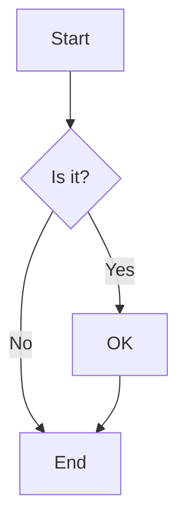
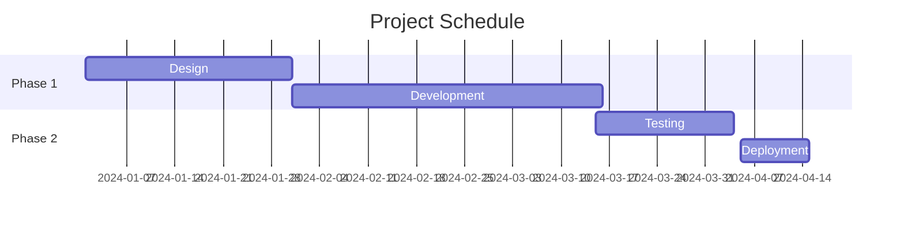
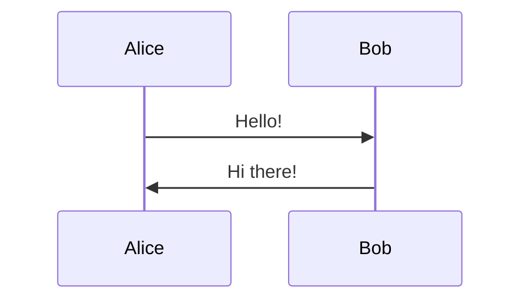
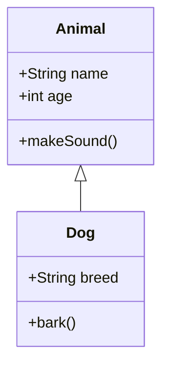
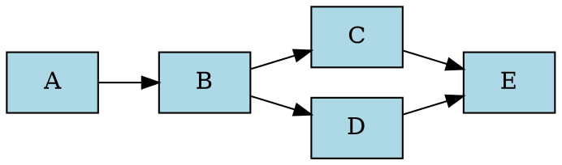
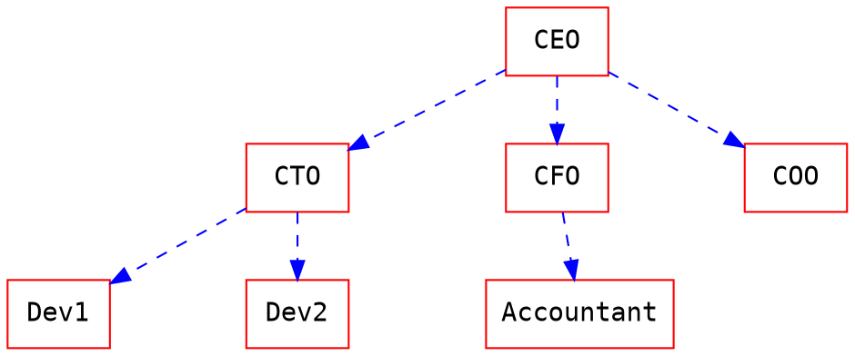
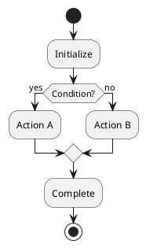
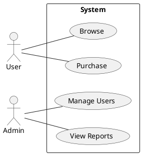

# HackMD Skill

This skill enables AI agents to create and edit HackMD documents with full support for HackMD Flavored Markdown, diagrams, and external embeds.

## Metadata (Title and Tags)

HackMD metadata is managed through the editor UI, not in the document content.

**Title**:
- Edit using the title field in the HackMD editor
- If not set, the first H1 header (`# Heading`) will be used as the title
- If no title or H1 exists, the note will be titled "Untitled"

**Tags**:
- Edit using the tags field in the HackMD editor

**Other Settings**:
- Configure in the note's "Settings" menu
- Slide mode settings are in the "Slide mode" section of the "Share" menu

## Tags (Inline Format)

Define tags inline at the start of document:

```markdown
###### tags: `feature` `documentation` `v2.0`
```

> [!NOTE]
> Tags can also be managed through the HackMD editor UI.

## Table of Contents

Auto-generate ToC with:

```markdown
[TOC]
```

This will be replaced with a hierarchical list of headers.

## Alert Boxes

Create colored alert boxes with:

```markdown
:::success
Success message with :tada: emoji!
:::

:::info
Information message with :mega: emoji!
:::

:::warning
Warning message with :zap: emoji!
:::

:::danger
Danger message with :fire: emoji!
:::

:::spoiler Click to reveal
Hidden content here :stuck_out_tongue_winking_eye:
:::

:::spoiler {state="open"} Expanded by default
This spoiler is open initially
:::
```

## Enhanced Blockquotes

Add author, time, and color to blockquotes:

```markdown
> This is a quote with metadata
> [name=John Doe] [time=2024-01-15 10:30] [color=#3b5998]

> Nested quotes also work
> [name=Jane Smith] [time=2024-01-15 10:35] [color=red]
> > Even deeper nesting!
> > [name=Bob] [time=2024-01-15 10:36] [color=#00ff00]
```

## Code Blocks with Line Numbers

```javascript=
// Line numbers start from 1
var s = "JavaScript";
alert(s);
```

```python=101
# Line numbers start from 101
def greet(name):
    print(f"Hello, {name}!")
```

```javascript=+
// Continue line numbers from previous block
var continuation = true;
```

### Code Wrapping

For long lines without breaks, add `!` after the language:

```javascript!
This is a very long line that will wrap instead of creating horizontal scroll, making it easier to read on mobile devices or narrow screens.
```

## CSV Tables

Render CSV data as tables:

~~~markdown
```csvpreview {header="true"}
Name,Email,Role
Alice,alice@example.com,Developer
Bob,bob@example.com,Designer
Charlie,charlie@example.com,Manager
```
~~~

Options:
- `header="true"` - First row as header
- `delimiter=","` - Custom delimiter
- See [Papa Parse docs](https://www.papaparse.com/docs#config) for more

## Typography Enhancements

| Syntax | Output | Description |
|--------|--------|-------------|
| `==marked==` | ==marked== | Highlighted text |
| `++inserted++` | ++inserted++ | Inserted text |
| `19^th^` | 19^th^ | Superscript |
| `H~2~O` | H~2~O | Subscript |
| `~~deleted~~` | ~~deleted~~ | Strikethrough |

## Ruby Annotations

For CJK text pronunciation:

```markdown
{ruby 漢字|かんじ}
{ruby 汉字|hànzì}
```

Or using superscript:

```markdown
ruby base ^ruby text^
```

## Emojis

Use emoji shortcodes:

```markdown
:smile: :heart: :thumbsup: :tada: :rocket:
```

## MathJax

Render mathematical expressions with LaTeX syntax.

**Inline math**:

```markdown
Inline math: $E = mc^2$
```

**Block math**:

```markdown
$$
\frac{1}{n} \sum_{i=1}^{n} x_i = \bar{x}
$$
```

## Footnotes

```markdown
Here's a sentence with a footnote[^1].

[^1]: This is the footnote content.
```

Multiple footnotes:

```markdown
First reference[^first], second reference[^second].

[^first]: First footnote content.
[^second]: Second footnote content.
```

## Definition Lists

```markdown
Term 1
: Definition 1a
: Definition 1b

Term 2
: Definition 2
```

## Task Lists

```markdown
- [ ] Incomplete task
- [x] Completed task
  - [ ] Nested subtask
  - [x] Completed subtask
```

## Diagrams

### Sequence Diagrams

```sequence
Alice->Bob: Hello Bob
Note right of Bob: Bob thinks
Bob-->Alice: Hi Alice
Note left of Alice: Alice responds
Alice->Bob: How are you?
```

Syntax:
- `->` : Solid line
- `-->` : Dashed line
- `Note right of X:` : Add note
- `Note left of X:` : Add note

### Flow Charts

```flow
st=>start: Start
e=>end: End
op=>operation: Process
cond=>condition: Decision?
io=>inputoutput: Input/Output

st->op->cond
cond(yes)->io->e
cond(no)->op
```

Node types:
- `start` - Start node
- `end` - End node
- `operation` - Process box
- `condition` - Decision diamond
- `inputoutput` - I/O parallelogram

### Mermaid Diagrams

#### Flowchart



#### Gantt Chart



#### Sequence Diagram



#### Class Diagram



### Graphviz



Advanced example:



### PlantUML

#### Activity Diagram



#### Use Case Diagram



### ABC Music Notation

```abc
X:1
T:Twinkle Twinkle Little Star
M:4/4
L:1/4
K:C
C C G G | A A G2 | F F E E | D D C2 |
G G F F | E E D2 | G G F F | E E D2 |
C C G G | A A G2 | F F E E | D D C2 |
```

### Vega-Lite (Data Visualization)

```vega
{
  "$schema": "https://vega.github.io/schema/vega-lite/v5.json",
  "data": {
    "values": [
      {"category": "A", "value": 28},
      {"category": "B", "value": 55},
      {"category": "C", "value": 43},
      {"category": "D", "value": 91}
    ]
  },
  "mark": "bar",
  "encoding": {
    "x": {"field": "category", "type": "nominal"},
    "y": {"field": "value", "type": "quantitative"}
  }
}
```

### Fretboard (Guitar Tabs)

```fretboard {title="C Major Chord", type="h6"}
-oO-*-
--o-o-
-o-oo-
-o-oO-
-oo-o-
-*O-o-
  3
```

Options:
- `type="h6"` - Horizontal, 6 frets
- `type="v6"` - Vertical, 6 frets
- `title="..."` - Add title

## External Embeds

### YouTube

```markdown


```

### Vimeo

```markdown


```

### GitHub Gist

```markdown


```

### SlideShare

```markdown


```

### Speaker Deck

```markdown


```

### PDF

```markdown

```

> [!WARNING]
> PDFs require HTTPS URLs and may be blocked by browsers with mixed content protection.

### Figma

```markdown


```

### HackMD Notes

Embed another HackMD note:

```markdown


```

## Slide Mode

Separate slides with horizontal (`---`) and vertical (`----`) dividers:

```markdown
# First Slide

Content here

---

# Second Slide (next horizontal slide)

More content

----

# Vertical Slide (below second slide)

Use four dashes for vertical slides

---

<!-- .slide: data-background="#ff0000" -->

# Slide with Red Background

You can add slide-specific attributes
```

> [!NOTE]
> Slide theme and transition settings should be configured in the "Slide mode" section of the "Share" menu.

## Book Mode

Create a book structure with nested links:

```markdown
# Book Title

## Chapter 1
- [Section 1.1](link-to-note-1)
- [Section 1.2](link-to-note-2)

## Chapter 2
- [Section 2.1](link-to-note-3)
  - [Subsection 2.1.1](link-to-note-4)
```

## Image Upload

Images can be embedded with size control:

```markdown


```

## Permissions & Sharing

While editing, permissions can be set via UI:
- **Read**: Owners, Signed-in users, Everyone
- **Write**: Owners, Signed-in users, Everyone
- **Comment**: Forbidden, Owners, Signed-in users, Everyone

## References

- [HackMD Features](https://hackmd.io/s/features)
- [HackMD Tutorial](https://hackmd.io/c/tutorials)
