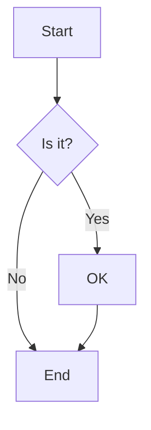
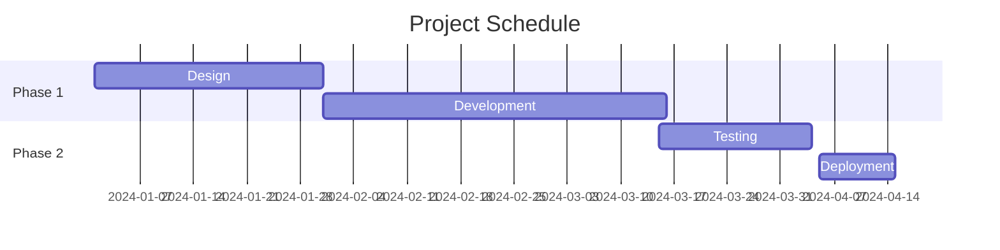
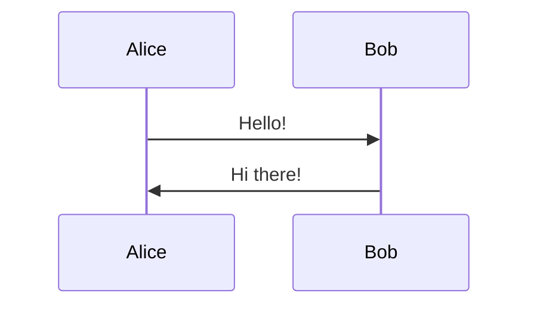
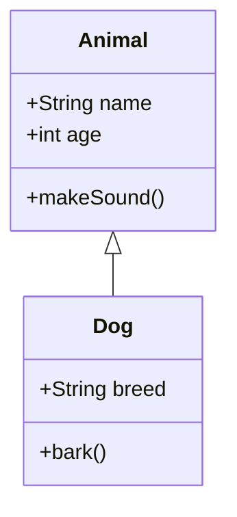
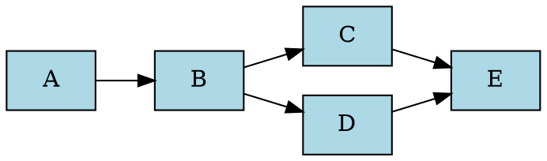
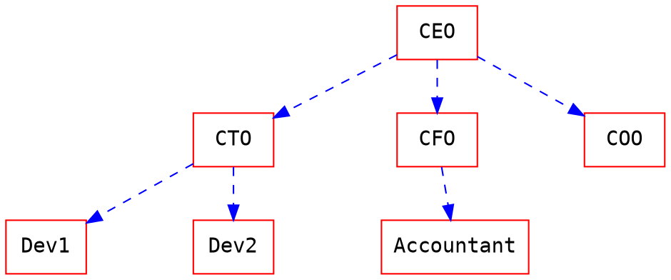

# Diagrams

Diagrams are fenced code blocks tagged with the diagram language.

## Sequence Diagrams

```sequence
Alice->Bob: Hello Bob
Note right of Bob: Bob thinks
Bob-->Alice: Hi Alice
Note left of Alice: Alice responds
Alice->Bob: How are you?
```

Syntax:
- `->` : Solid line
- `-->` : Dashed line
- `Note right of X:` : Add note
- `Note left of X:` : Add note

## Flow Charts

```flow
st=>start: Start
e=>end: End
op=>operation: Process
cond=>condition: Decision?
io=>inputoutput: Input/Output

st->op->cond
cond(yes)->io->e
cond(no)->op
```

Node types:
- `start` - Start node
- `end` - End node
- `operation` - Process box
- `condition` - Decision diamond
- `inputoutput` - I/O parallelogram

## Mermaid Diagrams

### Flowchart



### Gantt Chart



### Sequence Diagram



### Class Diagram



## Graphviz



Advanced example:



## PlantUML

### Activity Diagram

Do not wrap PlantUML in `@startuml` / `@enduml`; HackMD's own examples omit them.

```plantuml
start
:Initialize;
if (Condition?) then (yes)
  :Action A;
else (no)
  :Action B;
endif
:Complete;
stop
```

### Use Case Diagram

```plantuml
left to right direction
actor User
actor Admin

rectangle System {
  User -- (Browse)
  User -- (Purchase)
  Admin -- (Manage Users)
  Admin -- (View Reports)
}
```

## ABC Music Notation

```abc
X:1
T:Twinkle Twinkle Little Star
M:4/4
L:1/4
K:C
C C G G | A A G2 | F F E E | D D C2 |
G G F F | E E D2 | G G F F | E E D2 |
C C G G | A A G2 | F F E E | D D C2 |
```

## Vega-Lite (Data Visualization)

```vega
{
  "$schema": "https://vega.github.io/schema/vega-lite/v5.json",
  "data": {
    "values": [
      {"category": "A", "value": 28},
      {"category": "B", "value": 55},
      {"category": "C", "value": 43},
      {"category": "D", "value": 91}
    ]
  },
  "mark": "bar",
  "encoding": {
    "x": {"field": "category", "type": "nominal"},
    "y": {"field": "value", "type": "quantitative"}
  }
}
```

## Fretboard (Guitar Tabs)

```fretboard {title="C Major Chord", type="h6"}
-oO-*-
--o-o-
-o-oo-
-o-oO-
-oo-o-
-*O-o-
  3
```

Options:
- `type="h6"` - Horizontal, 6 frets
- `type="v6"` - Vertical, 6 frets
- `title="..."` - Add title
